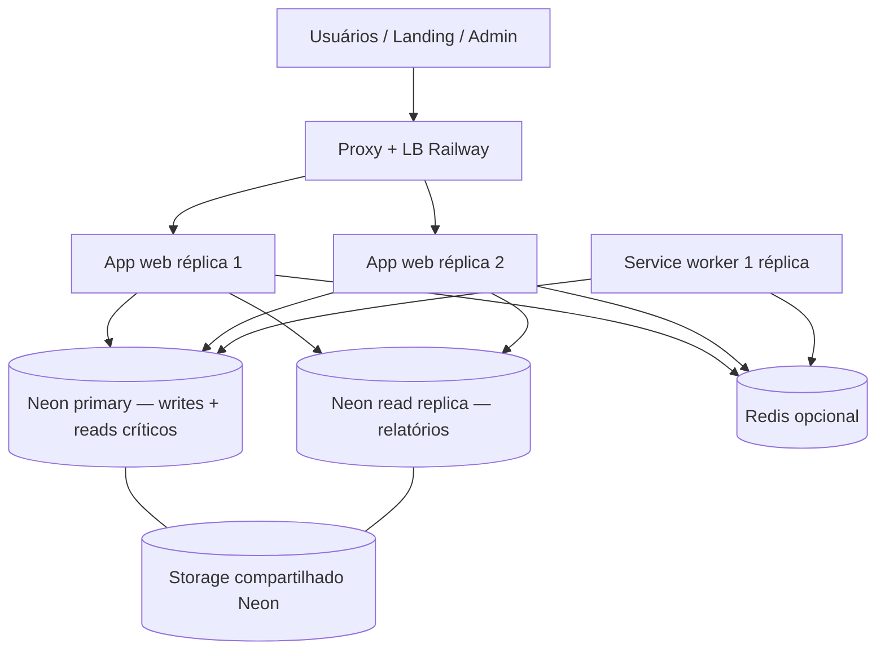

# Plano de arquitetura e escalabilidade — Trackion

Documento consolidado a partir da discussão sobre load balancer, Redis, réplicas de leitura (Neon) e otimização de analytics de trading. Serve como **roadmap** e **metodologia de implementação** — não é obrigatório executar tudo de uma vez.

**Stack atual (referência):**

| Componente | Implementação hoje |
|------------|-------------------|
| Deploy | Railway (`apps/app/railway.toml`) |
| App | Monólito Express + SPA estático (`apps/app/server/index.ts`) |
| Banco | PostgreSQL via Neon (`DATABASE_URL`, `server/lib/pg.ts`, Drizzle) |
| Sessão | `connect-pg-simple` no Postgres (`server/auth.ts`) — **compatível com múltiplas réplicas** |
| Proxy | `trust proxy` em produção (`server/index.ts`) |
| Rate limit | Em memória (`server/lib/rateLimit.ts`) — **bloqueia escala horizontal** |
| Cron billing | `setInterval` em cada instância (`server/billing/cron.ts`) — **duplica com N réplicas** |
| Relatórios | `SELECT` trades por usuário + agregação em Node (`server/reportRoutes.ts`, `server/services/reportAnalytics.ts`) |

---

## Princípios

1. **Escalar na ordem certa** — vertical → otimizar dados/queries → horizontal (app) → read replica → Redis/filas → separar worker.
2. **Um problema por vez** — medir antes (CPU, latência p95, conexões Postgres, tamanho de `trades` por usuário).
3. **Estado compartilhado explícito** — tudo que vive só na RAM de um processo quebra com 2+ instâncias.
4. **Writes no primary, reads analíticos na réplica** — quando existir réplica; nunca misturar sem regra clara.
5. **Manter o monólito** até o gargalo provar que precisa de outro serviço.

---

## Visão de arquitetura (alvo)



---

## Fase 0 — Baseline (antes de mudar infra)

**Objetivo:** saber *onde* escalar.

| Métrica | Onde olhar | Sinal de ação |
|---------|------------|---------------|
| CPU/RAM do service Railway | Dashboard Railway | >70% sustentado → Fase 1 ou 2 |
| Latência p95 `/api/reports/*` | Logs / APM | Alto com poucos usuários → Fase 4 (DB/query) |
| Conexões Postgres | Neon console | Próximo do limite → pool sizing / réplica |
| Trades por usuário (p95/max) | Query SQL ad hoc | Milhares por user → Fase 4 prioritária |
| Erros 429 auth | Logs | Rate limit ok; se escalar réplicas → Fase 2 |

**Checklist:**

- [ ] Definir SLO interno (ex.: relatório avançado &lt; 2s p95).
- [ ] Registrar tamanho típico de `getTrades(userId)` em produção.
- [ ] Confirmar `SESSION_SECRET`, `DATABASE_URL` e plano Neon/Railway.

---

## Fase 1 — Escala vertical (sem mudar código)

**Quando:** uma réplica, gargalo de CPU/RAM, poucos usuários simultâneos.

**Railway:**

- Aumentar recursos do service `apps/app`.
- Manter **1 réplica** até Fase 2 estar pronta.

**Neon:**

- Ajustar compute do branch primary (autoscaling min/max).

**Custo/benefício:** melhor ROI imediato; zero risco de cron/rate limit duplicado.

---

## Fase 2 — Pré-requisitos para réplicas da app (horizontal)

**Quando:** métricas da Fase 0 mostram necessidade de 2+ instâncias HTTP **ou** alta disponibilidade (uma instância cai, outra atende).

### 2.1 Load balancer na Railway

**Conceito:** não provisionar ALB separado. Ao aumentar **réplicas** do service, a Railway coloca proxy/LB na frente automaticamente.

**Passos:**

1. Railway → service da app → Scaling → aumentar réplicas (plano que suporte).
2. Manter `startCommand` em `apps/app/railway.toml` (sem mudança obrigatória).
3. `trust proxy` já habilitado em produção — manter.

**Sessão:** Postgres (`connect-pg-simple`) — **sticky session não necessária**.

### 2.2 Rate limit compartilhado (obrigatório antes de N &gt; 1)

**Problema:** `server/lib/rateLimit.ts` usa `Map` em memória; com 3 réplicas o limite efetivo ≈ 3×.

**Opções (escolher uma):**

| Opção | Prós | Contras |
|-------|------|---------|
| **A. Postgres** | Sem novo serviço; já tem Neon | Mais latência; precisa tabela + TTL/cleanup |
| **B. Redis** | Rápido; padrão para contadores | Novo serviço + custo Railway/Upstash |
| **C. Worker único + 1 réplica web** | Evita rate limit distribuído | Não escala HTTP |

**Metodologia (Redis — Opção B):**

1. Adicionar plugin Redis na Railway; variável `REDIS_URL`.
2. Substituir `Map` por `INCR` + `EXPIRE` (ou biblioteca `rate-limit-redis`).
3. Manter mesmas janelas (`auth:enter`, `auth:login`, etc. em `server/auth.ts`).
4. Testar: 2 réplicas, mesmo IP, limite deve bloquear na soma correta.

**Metodologia (Postgres — Opção A):**

1. Tabela `rate_limit_buckets` (`key`, `count`, `reset_at`).
2. Upsert atômico por request; job de limpeza ou `DELETE` lazy.
3. Usar primary (não réplica) para consistência do limite.

### 2.3 Cron de billing (obrigatório antes de N &gt; 1)

**Problema:** `startSubscriptionCron` roda em todo `listen` — trials podem ser processados em duplicata.

**Opções:**

| Opção | Descrição |
|-------|-----------|
| **A. Service worker** | Segundo service Railway: `startCommand` só cron + jobs; **1 réplica** |
| **B. Lock no Postgres** | `pg_advisory_lock` ou linha `cron_leases` antes de `runSubscriptionMaintenance` |
| **C. Neon + pg_cron** | Job SQL agendado (se política do projeto permitir) |

**Metodologia recomendada (worker):**

1. Extrair flag/env: `PROCESS_ROLE=web` | `worker`.
2. `web`: não chama `startSubscriptionCron`.
3. `worker`: chama cron; opcionalmente filas futuras.
4. Dois services no mesmo projeto Railway, mesmo `DATABASE_URL`.

**Checklist Fase 2:**

- [ ] Rate limit global implementado e testado com 2 réplicas.
- [ ] Cron executado em um único lugar (worker ou lock).
- [ ] Réplicas web ≥ 2 em staging; smoke test login + relatório + sync exchange.
- [ ] Monitorar erros de sessão (não deve aumentar).

---

## Fase 3 — Redis (opcional, sob demanda)

**Quando:** Fase 2 com Redis já escolhida para rate limit **ou** necessidade de fila/cache.

**Não usar Redis para:**

- Sessão (Postgres já resolve multi-réplica).
- Substituir Postgres como fonte da verdade.

**Usar Redis para:**

| Caso | Prioridade |
|------|------------|
| Rate limit global | Alta (se Opção B na Fase 2) |
| Fila de jobs (BullMQ) — sync trades, relatórios pesados | Média, quando sync bloquear API |
| Cache de cotações / insights semanais | Baixa até volume justificar |
| Distributed lock (alternativa ao advisory lock) | Baixa se worker único bastar |

**Metodologia Railway:**

1. Adicionar Redis (template Railway ou Upstash).
2. `REDIS_URL` no service web e worker.
3. Health check na subida da app (opcional).

**Ordem sugerida:** rate limit → fila de sync → cache analítico.

---

## Fase 4 — Banco de dados e analytics de trading

**Quando:** relatórios lentos, primary Neon com CPU alta em **reads**, ou usuários com histórico grande de trades.

### 4.1 Otimização no primary (fazer antes da read replica)

**Problema atual:** `getTrades` faz `SELECT *` por `userId` e ordena em memória; relatórios agregam no Node.

**Implementação sugerida (ordem):**

1. **Índice** `(user_id, date DESC)` em `trades` (migration Drizzle).
2. **Filtro por período** nas rotas `/api/reports/*` (query params `from` / `to`); default alinhado a `entitlements.historyDays`.
3. **Agregações no SQL** para métricas de relatório avançado (reduzir payload para Node).
4. **Tabela ou cache de snapshots** (ex.: insights semanais por `user_id` + `week`) — invalidar no write de trade.

**Arquivos tocados (referência):**

- `apps/app/server/storage.ts` — novos métodos `getTradesInRange`, agregados.
- `apps/app/server/reportRoutes.ts` — passar filtros.
- `apps/app/server/services/reportAnalytics.ts` — consumir menos dados ou receber rows pré-agregadas.
- `packages/shared` / schema Drizzle — índices.

### 4.2 Read replica no Neon

**Conceito:** compute read-only, **mesmo storage** que o primary; connection string separada; lag pequeno (eventual consistency).

**Neon:**

- Console → branch de produção → **Add read replica**.
- Copiar connection string read-only.
- Docs: https://neon.com/docs/introduction/read-replicas

**Variáveis de ambiente:**

```env
DATABASE_URL=postgresql://...   # primary — writes + reads críticos
DATABASE_URL_READ=postgresql://...  # read replica — só SELECT
```

**Metodologia no código:**

1. `createPgPool()` para primary; `createPgReadPool()` se `DATABASE_URL_READ` existir (fallback: primary).
2. Segundo cliente Drizzle `dbRead` ou factory `getDb('read' | 'write')`.
3. **Rotear para réplica:**
   - `GET /api/reports/*`
   - Listagens pesadas somente leitura
4. **Manter no primary:**
   - Auth, sessão, billing, Stripe webhooks
   - `INSERT`/`UPDATE`/`DELETE` trades, sync exchanges
   - Rate limit (se implementado em Postgres)
5. Documentar lag: relatório pode omitir trade salvo há &lt;1s (aceitável para analytics).

**Plano Free Neon:** até 3 read replicas por projeto.

### 4.3 Branch analítico (futuro, opcional)

- Branch Neon separado para BI (Metabase) ou exports massivos — não misturar com app online.
- Diferente de read replica 24/7 no mesmo branch.

---

## Fase 5 — Worker e jobs assíncronos

**Quando:** sync MEXC/Binance/Bitget ou relatórios passam a degradar latência da API.

**Metodologia:**

1. Service `worker` (1 réplica) na Railway.
2. API enfileira job (`sync-trades:{userId}`) — Redis + BullMQ ou tabela `job_queue` no Postgres.
3. Worker consome, atualiza trades, emite log/métrica.
4. Cliente polling ou WebSocket (só se produto exigir UX em tempo real).

**Arquivos relacionados hoje:** `server/exchanges/syncTrades.ts`, hooks em `client`.

---

## Matriz de decisão rápida

| Sintoma | Ação primeiro |
|---------|----------------|
| App lenta, 1 usuário, relatório grande | Fase 4.1 (índice + filtro + SQL) |
| App ok, muitos usuários, CPU Neon read alta | Fase 4.2 (read replica) |
| CPU app alta, poucas queries DB | Fase 1 vertical, depois Fase 2 réplicas |
| 429 auth “estranho” com 2 réplicas | Fase 2.2 rate limit |
| Trials processados 2× | Fase 2.3 cron |
| Sync trava request HTTP | Fase 5 worker + fila (Fase 3 Redis se BullMQ) |

---

## Roadmap resumido (timeline sugerida)

| Etapa | Entrega | Dependência |
|-------|---------|-------------|
| **0** | Métricas e SLO | — |
| **1** | Scale vertical Railway + Neon | 0 |
| **2** | Rate limit global + cron único | Antes de réplicas &gt; 1 |
| **3** | 2+ réplicas web Railway | 2 |
| **4.1** | Índices + queries de relatório | Pode paralelo a 1 |
| **4.2** | `DATABASE_URL_READ` + roteamento | 4.1 parcialmente |
| **3b** | Redis (se fila/cache) | 2 ou 5 |
| **5** | Worker + fila sync | 3, opcional Redis |

---

## Checklist de produção (antes de escalar réplicas)

- [ ] `SESSION_SECRET` forte e único por ambiente
- [ ] `DATABASE_URL` com `sslmode=verify-full` (já normalizado em `server/lib/pg.ts`)
- [ ] Rate limit não depende só de memória local
- [ ] Cron em um único executor
- [ ] Pool Postgres: `max` por instância × réplicas &lt; limite Neon
- [ ] Relatórios testados com réplica (se usar): lag aceitável para produto
- [ ] Backups / PITR Neon configurados (console)

---

## Referências internas

| Tópico | Caminho |
|--------|---------|
| Deploy Railway | `apps/app/railway.toml` |
| Sessão multi-instância | `apps/app/server/auth.ts` |
| Trust proxy | `apps/app/server/index.ts` |
| Rate limit | `apps/app/server/lib/rateLimit.ts` |
| Cron billing | `apps/app/server/billing/cron.ts` |
| Relatórios | `apps/app/server/reportRoutes.ts`, `server/services/reportAnalytics.ts` |
| Pool PG | `apps/app/server/lib/pg.ts`, `server/db.ts` |
| Playbook billing | `docs/billing-module-playbook.md` |

## Referências externas

- [Neon — Read replicas](https://neon.com/docs/introduction/read-replicas)
- [Neon — Criar e gerenciar read replicas](https://neon.com/docs/guides/read-replica-guide)
- [Railway — Scaling](https://docs.railway.com) (réplicas por service)

---

## Histórico

| Data | Nota |
|------|------|
| 2026-05-27 | Plano inicial consolidado (LB Railway, Redis, Neon read replica, estado atual do repo) |
